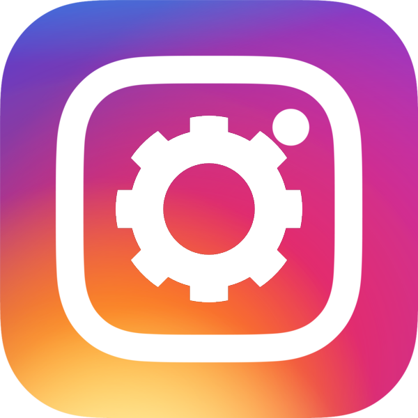

<br/>
<p align="center">
  <a href="https://github.com/TruFoox/Instagram-Meme-Bot">
    
  </a>

  <h3 align="center">Instagram Meme Bot</h3>

  <p align="center">
    An Automated Meme-Posting Bot for Instagram!
    <br/>
    <br/>
    <a href="https://github.com/TruFoox/Instagram-Meme-Bot/issues">Report Bug</a>
    .
    <a href="https://github.com/TruFoox/Instagram-Meme-Bot/issues">Request Feature</a>
  </p>
</p>

   

## Table Of Contents

* [About the Project](#about-the-project)
* [Getting Started](#getting-started)
  * [Prerequisites](#prerequisites)
  * [Installation](#installation)
* [Usage](#usage)
* [Built With](#built-with)
* [Help](#help)
* [Contributing](#contributing)
* [Authors](#authors)
* [Acknowledgements](#acknowledgements)

## About The Project

This is a simple, lightweight, yet powerful meme-posting bot for instagram, with LOADS of features, and more to come! This bot works by grabbing memes off of various configurable subreddits using the D3vd's [Meme API](https://github.com/D3vd/Meme_Api).

A few of our currently available features:
* NSFW filter
* Configurable subreddits
* Prioritize some subreddits over others
* Automatic/Customizable caption/hashtags
* Customizable wait times between posts
* Word blacklist
* Duplicate post prevention

## Getting Started

Follow ALL the directions listed below in order for the bot to function correctly. See "Config Help.txt" for more information regarding the config.

### Prerequisites

Before anything, you need to have Python 3 downloaded and installed. [You can download the latest version of Python here](https://www.python.org/downloads/)

This program uses a few libraries that might require you to download them if you haven't used them before

* requests
* colorama
* pillow
* numpy

Use this command in the command prompt to download all of the requirements:
```sh
pip install requests colorama pillow numpy
```

### Installation

1. Go to [this URL](https://developers.facebook.com/tools/explorer/)
  
2. Press the blue "Generate Access Token" button. It will ask you to log in to your Facebook account, which is required. Make sure you log into whichever Facebook account owns the Instagram account you intend to use.

3. Go to [this URL](https://developers.facebook.com/tools/debug/accesstoken) and input the access token you just generated

4. Press the blue "Debug" button. After the new webpage loads, scroll down to the bottom and press "Extend Access Token"

5. It will give you a different access token, which will last much longer than an ordinary access token. Place the result inside this section of config.json:
```json
"API_Key": "API KEY HERE",
```
Further instruction for how to get your UserID will be added at a later date

## Help

Please DM me on my [bot's Instagram page](https://www.instagram.com/dank.ai.memer/) or DM me on Discord (@TruFoox) for questions. I will both assist you there and, if the question is common enough, I will answer it here!

## Usage

This bot generally requires zero input from the user while it is running, but YOU MUST MAKE SURE TO MONITOR WHAT THE BOT POSTS!

If you fail to do so, the bot could post something against Instagram's TOS. This can be minimized, however, by keeping NSFW disabled in the config and only choosing from subreddits with infrequent unmarked NSFW.

## Built With

Programmed entirely in Python3 using the Requests, Colorama, Pillow, and Numpy libraries

## Contributing

Contributions are what make the open source community such an amazing place to be learn, inspire, and create. Any contributions you make are **greatly appreciated**.
* If you have suggestions for adding or removing projects, feel free to [open an issue](https://github.com/TruFoox/Instagram-Meme-Bot/issues/new) to discuss it, or directly create a pull request after you edit the *README.md* file with necessary changes.
* Please make sure you check your spelling and grammar.
* Create individual PR for each suggestion.
* Please be a decent human being with your edits

### Creating A Pull Request

1. Fork the Project
2. Create your Feature Branch (`git checkout -b feature/AmazingFeature`)
3. Commit your Changes (`git commit -m 'Add some AmazingFeature'`)
4. Push to the Branch (`git push origin feature/AmazingFeature`)
5. Open a Pull Request

## Author

* **Landen Laflamme** - [TruFoox](https://github.com/TruFoox/) - *Created/Programmed this bot!*

## Acknowledgements

* **Dev Daksan** - [D3vd](https://github.com/D3vd) - *Created the Meme API, which simplified programming this bot by creating an easy way to grab images off Reddit!*
